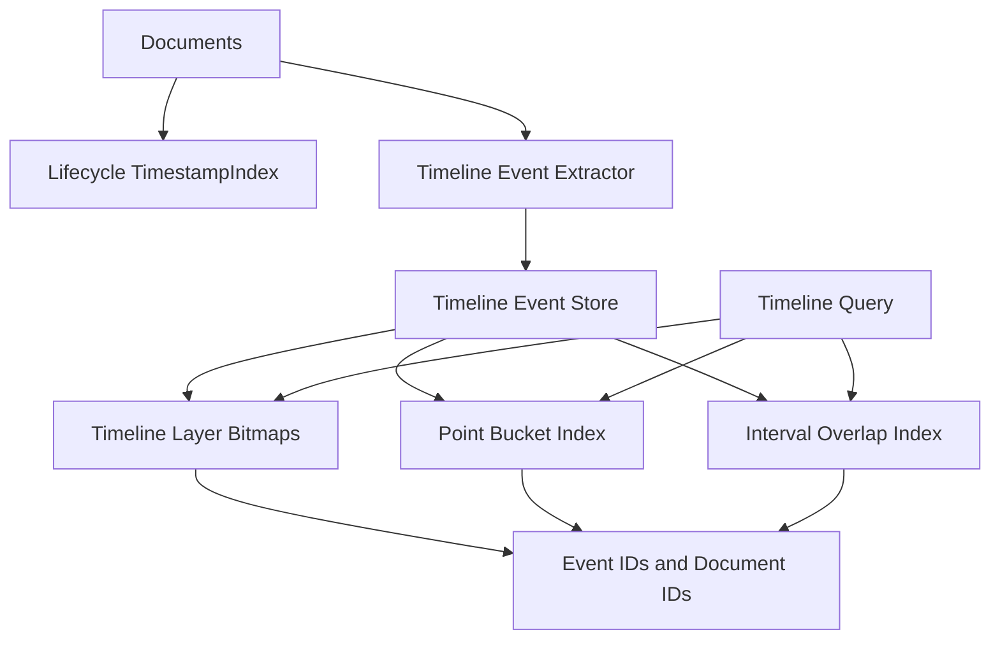

# Timeline Index Architecture

## Recommendation

Do **not** stretch [`src/indexes/inverted/Timestamp.js`](src/indexes/inverted/Timestamp.js) into a god-object. It currently indexes document lifecycle timestamps only: `created`, `updated`, `deleted`, one integer timestamp per document/action, backed by [`BitSlicedIndex`](src/indexes/bitmaps/lib/BitSlicedIndex.js). That is fine for `updated:thisWeek`; it is the wrong primitive for “middle ages overlaps 1720 across wikipedia.timeline and historian_x.timeline”. Tiny hammer, very large clock.

Recommended shape:

## Architecture Changes

- Keep the current lifecycle API in [`Timestamp.js`](src/indexes/inverted/Timestamp.js): `insert(action, timestamp, id)`, `findByTimeframe()`, `findByRangeAndAction()`. Existing filters in [`src/utils/filters.js`](src/utils/filters.js) depend on this action-based model.

- Add a real timeline index as a separate class, either exported from the same module for now or placed beside it as `Timeline.js`. I would prefer `Timeline.js` and have `Timestamp.js` stay boring. Boring is maintainable. The public shape should be event-oriented:
  - `insertEvent({ timeline, docId, start, end, startClosed, endClosed, precision, anchors })`
  - `queryPoint({ timelines, at, precision, anchors })`
  - `queryRange({ timelines, start, end, mode })`
  - `removeDocument(docId)`

- Store timeline events as first-class records, not as document timestamp values. One document can mention 200 dates and 10 periods. Current BSI cannot represent that because [`BitSlicedIndex.setValue(id, value)`](src/indexes/bitmaps/lib/BitSlicedIndex.js) overwrites the value for the same id within one BSI.

- Use generated `eventId`s as the bitmap row IDs for timeline queries. Keep mappings:
  - `eventId -> { docId, timeline, start, end, precision, anchors }`
  - `docId -> eventIds`
  - query returns event records, with a helper to collapse to doc IDs when the old search path only wants documents.

- Make `timeline` a first-class dimension. Use key prefixes like `timeline/<timelineId>/...`, matching the existing bitmap namespace style. This gives clean composability: `wikipedia.timeline`, `family.timeline`, `person_foo.timeline` are independent layers that can be ORed/ANDed at query time.

- Use two index families:
  - Point/bucket index for exact or coarse points: hierarchical keys such as `timeline/wiki/y/1720`, `timeline/wiki/m/1720-04`, `timeline/wiki/d/1720-04-17` mapped to eventId bitmaps.
  - Interval index for overlap queries: store start and end in BSIs per timeline/precision where possible, then overlap is `start <= queryEnd AND end >= queryStart`, with endpoint flags checked from the event record. This avoids adding a dependency before we know we need one.

- Do **not** aim for one universal nanosecond-scale integer. It is architecturally silly for geology and still annoying for emails. Use precision-aware temporal values instead:
  - `year`, `month`, `day`, `hour`, `minute`, `second`
  - normalize queries to the coarsest useful bucket first
  - only hit finer buckets when the query asks for them

- Add a small `TimeCodec` utility. Its job: parse ISO/EDTF-ish inputs into `{ value, precision, sortKey }`, validate interval endpoints, and generate bucket keys. Keep it small; full EDTF can wait unless you actually need uncertain dates now.

- Keep semantic anchors out of the timeline index core. Store anchor bitmaps as optional filters attached to event IDs. The semantic layer can generate/filter anchors later without polluting interval logic.

## Minimal Implementation Plan

1. Rename the mental model, not necessarily the file: `TimestampIndex` remains lifecycle timestamps; new `TimelineIndex` handles extracted timeline events.
2. Add `TimelineIndex` with event store, layer bitmap, bucket bitmap, start BSI, end BSI, and doc/event mappings.
3. Add `TimeCodec` with only the precisions needed now: `year`, `month`, `day`, `second`.
4. Add point and overlap query methods.
5. Wire a new filter shape beside existing `datetime:*`, for example object filters: `{ type: 'timeline', timelines: ['wikipedia.timeline'], at: '1720', anchors: ['science'] }`.
6. Leave `datetime:updated:thisWeek` alone. That is lifecycle search, not timeline search.

## Why This Is The Smallest Useful Design

The current BSI can still do useful numeric range work, but only after we stop pretending document IDs are timeline event IDs. The least invasive change is to add event IDs and named timeline prefixes, then reuse Roaring bitmaps and BSI where they fit. No interval-tree dependency yet, no 128-bit monster timestamp, no calendar PhD hiding in the hot path.
